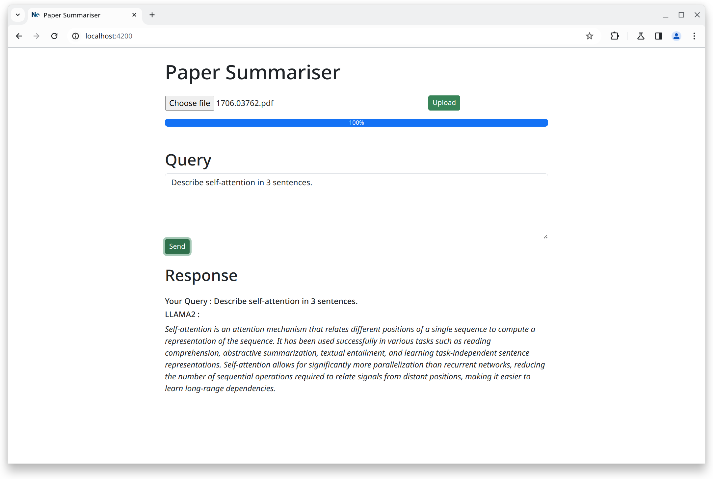

# paper-chat-qa


Summarises and answers queries on research papers using Retrieval Augmented Generation using LLAMA2. 



## retriever module

- Language Model: Llama2
- VectorDB: ChromaDB
- Chains: Langchain
- File format: PDF

### cli usage

```bash
cd retriver
python cli.py -f file_path -pdir persist_dir 
# -pdir is optional and only needed if you want to store the 
# vectors on disk
```

The cli provides a shell to run queries via langchain. Type `/exit` to quit the shell.

### REST api

```bash
cd retriever
uvicorn api:app --host 0.0.0.0 --port 8000
```

#### Endpoints

- `/` : root
- `/upload` : upload file as multipart POST request
- `/query`: send query as json, POST

For detailed API docs, check `http://0.0.0.0:8000/docs`.

## web frontend

```bash
cd web
npm install
npm run start
```

The web frontend runs on `http://localhost:4200`.

## Docker

```bash
sudo docker compose up
# or, docker compose up
# depending on your OS
```

Due to image definition, the ollama container does not recognise the `ollama` command, which one would otherwise use to pull models. To circumvent this issue, run the `pull_llama2.sh` script once docker compose is done building images and is running all the services.

```bash
chmod +x scripts/pull_llama2.sh
./scripts/pull_llama2.sh
# this will take a while depending on your internet connection
```

Once up and running, you can access the web service as usual at `http://localhost:4200`. The REST api can be accessed at `http://localhost:9000`. If you wish to change these port numbers, edit the `docker-compose.yml` file accordingly.


## env setup

#### conda

```bash
cd retriever
conda env create -f environment.yml
```

#### venv

```bash
cd retriever
python -m venv venv
source venv/bin/activate
pip install -r requirements.txt
```

## TODO

- [ ] Keep a history of documents in the vector database
- [ ] Show error message in the web ui instead of File has been uploaded
- [ ] A progress bar while embeddings are being loaded, it works fast on GPUs but for CPUs, takes a while
- [ ] Pass API url to web as an ENV var. Currently it's hard coded.
